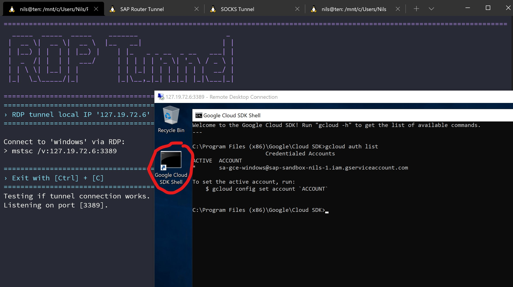
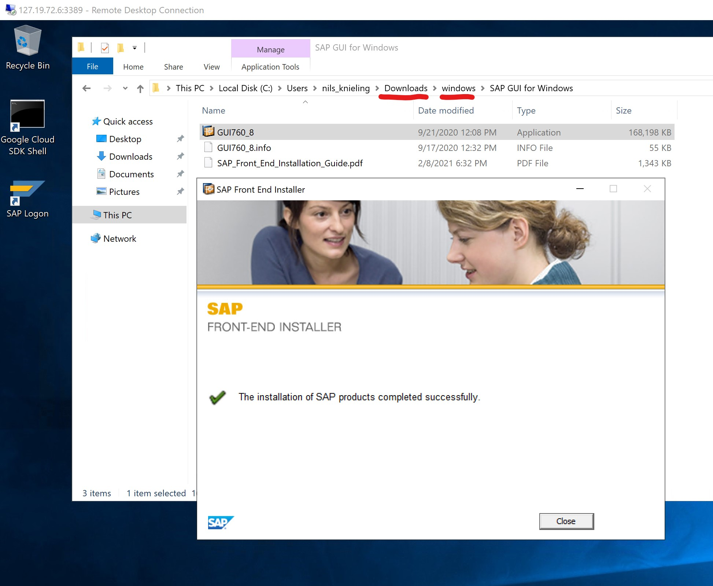
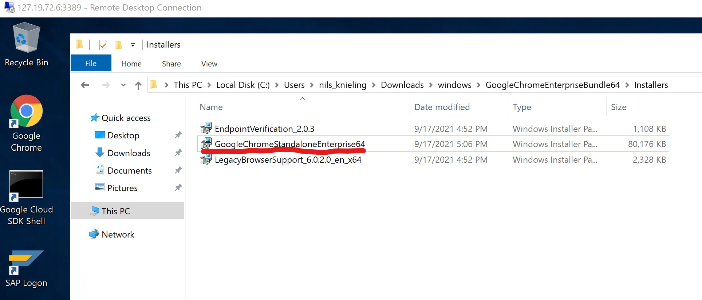

# Windows Server 2019

Create service account and Compute Engine virtual machine instance with Microsoft Windows Server 2019 as operating system.

## Configuration

Configuration other than default values:

| Variable | Description | Value |
|----------|-------------|-------|
| MY_GCP_GCE_NAME | Name of GCE virtual machine instance | `windows` |
| MY_GCP_GCE_TYPE | GCE machine type | `g1-small` [vCPU: shared, RAM: 1.7 GB] |
| MY_GCP_GCE_DISK_BOOT_SIZE | Size of the boot disk | `64GB` |
| MY_GCP_GCE_DISK_BOOT_TYPE | Type of the boot disk | `pd-standard` (HDD) |
| MY_GCP_GCE_IMAGE_FAMILY | Image family for the OS that the boot disk will be initialized with | `windows-2019` |
| MY_GCP_GCE_IMAGE_PROJECT | Project against image family references | `windows-cloud` |

## Pricing

[Google Cloud Pricing Calculator](https://cloud.google.com/products/calculator/#id=18c7195b-a1a0-478d-b6b8-6adceccb53a4)

* Region: Finland
* 730 total hours per month
* VM class: regular
* Instance type: `g1-small` (USD 14.46) [Sustained Use Discount applied]
* Operating System / Software: Paid (USD 16.79)
* Sustained Use Discount: 30%
* Effective Hourly Rate: USD 0.043
* Zonal standard PD: 64 GiB (USD 2.82) [HDD not SSD! When the instance is shut down, you only pay the ring price for the disc.]
* Total Estimated Cost: USD 34.07 per 1 month

Windows Server 2019 usage fee billed by Google:

* EUR 0.02/hour (EUR 12.38/month) for `f1-micro` and `g1-small` machine types
* EUR 0.03/core/hour (EUR 24.77/core/month) for all other machine types

Information without guarantee.

## Scripts

* `01_create_windows.sh`         : Create service account and Compute Engine virtual machine instance
* `02_reset_windows_password.sh` : Reset and return a password for a Windows machine instance
* `10_rdp_windows.sh`            : Starts an IAP TCP forwarding tunnel for RDP
* `20_serial_console_windows.sh` : Connecting to the serial console
* `99_delete_windows.sh`         : Delete Compute Engine virtual machine instance and service account

## RDP

Connect to Windows Server via RDP.

1. Starts an IAP TCP forwarding tunnel for RDP with script `10_rdp_windows.sh`
2. Connect to local IP `127.19.72.6` via RDP client

## Software

Use the storage bucket created in step 03 to exchange installation files for extra software.

### SAP GUI for Windows

Download the SAP GUI for Windows installation archive from the web page: <https://developers.sap.com/trials-downloads.html?search=sap+gui+for+windows>

1. Download the `SAP_GUI_for_Windows.rar` archive
2. Unrar archives with [7-Zip](https://www.7-zip.org/) or [WinRAR](https://www.rarlab.com/)
3. Copy unpacked folder to `../storage_bucket/windows/`
4. Run the script `10_sync_storage_bucket.sh` in folder `03_storage` to synchronize the files to the bucket

### Chrome

Download the latest stable Chrome browser for Windows installation archive from the web page: <https://chromeenterprise.google/browser/download/>

1. Download the `GoogleChromeEnterpriseBundle64.zip` archive
2. Unzip archive with [7-Zip](https://www.7-zip.org/) or with the standard ZIP program of your operating system
3. Copy unpacked folder to `../storage_bucket/windows/`
4. Run the script `10_sync_storage_bucket.sh` in folder `03_storage` to synchronize the files to the bucket

## Install

Connect to Windows Server via RDP.

### Google Cloud SDK

Start `Google Cloud SDK Shell`:



### Synchronize bucket

Download bucket content with command:
```shell
gsutil -m rsync -r "gs://<MY_GCP_STORAGE>/windows" "%HOMEPATH%\Downloads"
```

Example:
```shell
gsutil -m rsync -r "gs://storage-bucket-name/windows" "%HOMEPATH%\Downloads"
```

### Setup

Run the setup programs from the Downloads folder.

SAP GUI for Windows:


Google Chrome:

