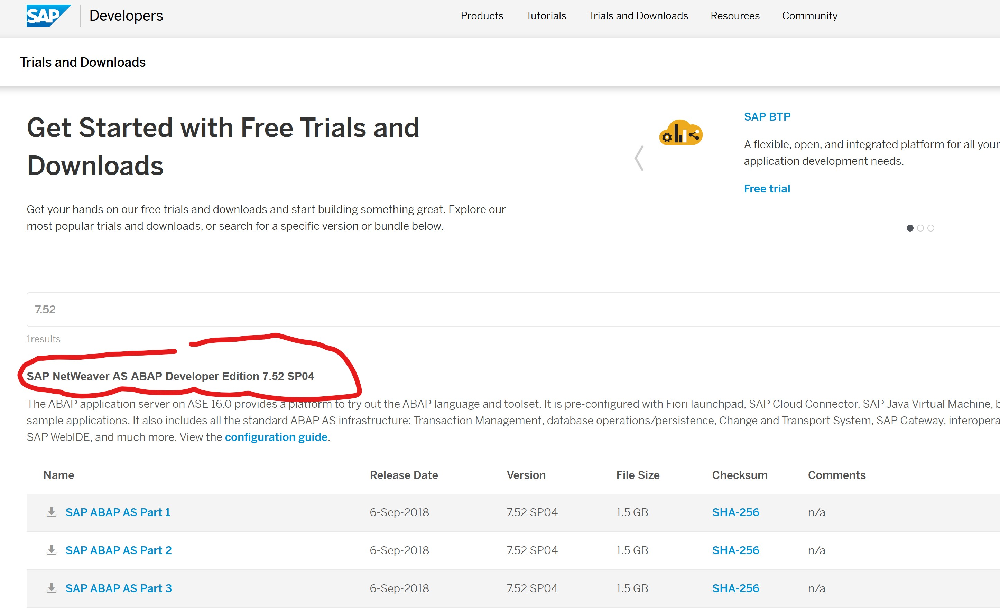
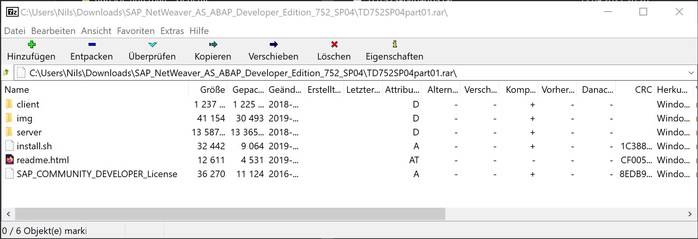
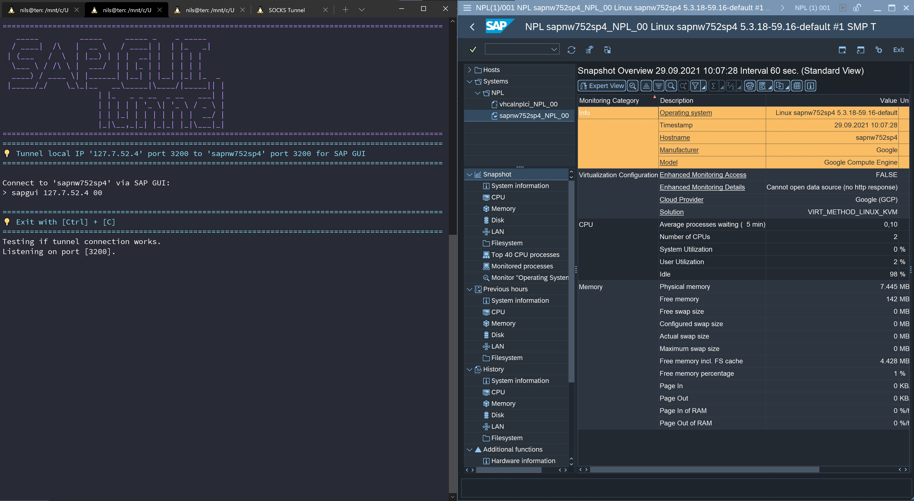
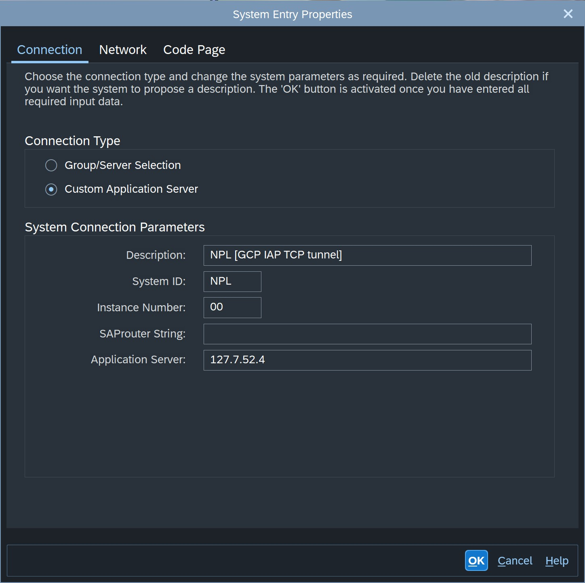
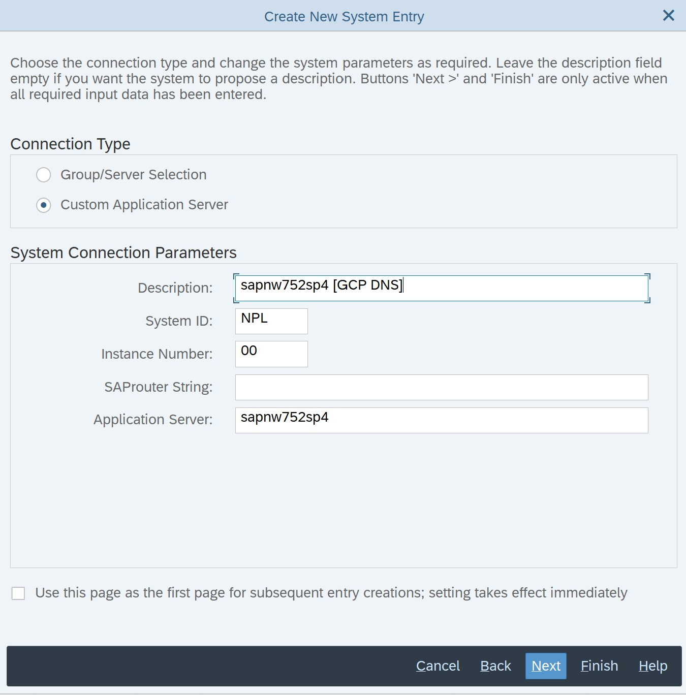

# SAP NetWeaver AS ABAP Developer Edition 7.52 SP04

The ABAP application server on ASE 16.0 provides a platform to try out the ABAP language and toolset.

It is pre-configured with:

* Fiori launchpad,
* SAP Cloud Connector,
* SAP Java Virtual Machine,
* backend/frontend connections,
* roles, and
* sample applications.

It also includes all the standard ABAP AS infrastructure:

* Transaction Management,
* database operations/persistence,
* Change and Transport System,
* SAP Gateway,
* interoperability with ABAP Development Toolkit and SAP WebIDE, and
* much more.

## Configuration

Configuration other than default values:

| Variable | Description | Value |
|----------|-------------|-------|
| MY_GCP_GCE_NAME | Name of GCE virtual machine instance | `sapnw752sp4` |
| MY_GCP_GCE_TYPE | GCE machine type | `n1-standard-2` |
| MY_GCP_GCE_DISK_BOOT_TYPE | Type of the boot disk | `pd-ssd` |
| MY_GCP_GCE_DISK_BOOT_SIZE | Size of the boot disk | `250GB` |
| MY_GCP_GCE_IMAGE_FAMILY | Image family for the OS that the boot disk will be initialized with | `sles-15-sp3-sap` |
| MY_GCP_GCE_IMAGE_PROJECT | Project against image family references | `suse-sap-cloud` |

## Pricing

[Google Cloud Pricing Calculator](https://cloud.google.com/products/calculator/#id=16f48885-e5a1-4eac-91ce-0d745d816a76)

* Region: Finland
* 730 total hours per month
* VM class: regular
* Instance type: `n1-standard-2` (USD 53.40) [Sustained Use Discount applied]
* Operating System / Software: Paid (USD 124.10)
* Sustained Use Discount: 30%
* Effective Hourly Rate: USD 0.243
* Zonal SSD PD: 250 GiB (USD 46.75)
* Total Estimated Cost: USD 224.25 per 1 month 

SUSE Linux Enterprise Server 15 for SAP usage fee billed by Google:

* EUR 0.14/hour (EUR 105.27/month) for 1-2 vCPU machine types
* EUR 0.29/hour (EUR 210.55/month) for 3-4 vCPU machine types
* EUR 0.35/hour (EUR 253.90/month) for 5+  vCPU machine types

Information without guarantee.

## Scripts

* `01_create_sapnw752sp4.sh`        : Create service account and Compute Engine virtual machine instance
* `10_ssh_sapnw752sp4.sh`           : SSH into a Linux virtual machine instance
* `20_install_sapnw752sp4.sh`       : Install SAP NetWeaver AS ABAP Developer Edition 7.52 SP04 on virtual machine instance
* `25_gui_tunnel_sapnw752sp4.sh`    : Starts an IAP TCP forwarding tunnel for SAP GUI
* `30_access_secret_sapnw752sp4.sh` : Access secret version's data - Show OS password for SAP installation
* `99_delete_sapnw752sp4.sh`        : Delete Compute Engine virtual machine instance and service account
* `ZZ_debug.sh`                     : For debugging only

### Snapshots

If you don't need your VM for a long time you can make a snapshot from the disk.
You can then delete the VM and the disk (`99_delete_sapnw752sp4.sh`).
If you need the VM with the data again, you can create a new fresh VM from the snapshot.

* `30_create_snapshot_sapnw752sp4.sh`      : Create snapshot of Compute Engine persistent boot disk
* `31_create_from_snapshot_sapnw752sp4.sh` : Create Compute Engine persistent boot disk from last snapshot and create virtual machine instance with created disk
* `39_delete_snapshots_sapnw752sp4.sh`     : Delete all Compute Engine boot disk snapshots from specific instance

You will then save the [disk cost](https://cloud.google.com/compute/all-pricing#disk) and pay only the very cheap [snapshot price](https://cloud.google.com/compute/all-pricing#disk).

* Regional snapshot storage $0.029 per GB in `europe-north1` (Finland)
* Multi-regional snapshot storage $0.0286 per GB in `eu` (European Union) [DEFAULT]

Example:

```shell
# Create snapshot
bash 30_create_snapshot_sapnw752sp4.sh
# Delete SA, Disk and VM
bash 99_delete_sapnw752sp4.sh
# Later, create new VM from snapshot
bash 31_create_from_snapshot_sapnw752sp4.sh
# Delete all snapshots
bash 39_delete_snapshots_sapnw752sp4.sh
```

## Documentation

* [AS ABAP 752 SP04, developer edition: NOW AVAILABLE](https://blogs.sap.com/2019/07/01/as-abap-752-sp04-developer-edition-to-download/)
* [AS ABAP 7.52 SP04, Developer Edition: Concise Installation Guide](https://blogs.sap.com/2019/10/01/as-abap-7.52-sp04-developer-edition-concise-installation-guide/)

## License

You need to read and accept the Software End User License Agreement:

[SAP DEVELOPER CENTER MASTER SOFTWARE DEVELOPER LICENSE AGREEMENT](https://www.sap.com/content/dam/site/campaigns/assets/2020/10/master-developer-center-license-multiple-wsa.pdf) (PDF)

ASE Enterprise Edition Trial License for SAP Business Applications will expire: March 31st 2022

You probably need to renew the SAP NetWeaver ABAP license after installation:

* Login to your NetWeaver ABAP system on client 000, userid: `SAP*`, password: `Down1oad`
* Go to transaction `slicense`, write down the hardware key, keep this window open
* Open a web browser and point to <https://go.support.sap.com/minisap/#/minisap>
* Select from the list the system NPL – SAP NetWeaver 7.x (Sybase ASE)
* Scroll down and enter salutation, first name, last name, email, and hardware key. Click on I agree for the License agreement and click on Generate
* Save the license key file as NPL.txt to your desktop
* Return to the SAPGUI screen and in the slicense transaction, click on the menu Edit -> Install license and navigate to the NPL.txt

## Software

Use the storage bucket created in step 03 to exchange installation files for extra software.

### Download

Download the `SAP NetWeaver AS ABAP Developer Edition 7.52 SP04` installation archives from the web page: <https://developers.sap.com/trials-downloads.html?search=7.52>



Download the `License.rar` (release date 21-Feb-2021) 
and `TD752SP04part01.rar` up to `TD752SP04part11.rar` (release date 6-Sep-2018) archive files (13.5 GB):

```
$ ls -lah *.rar
-rwxrwxrwx 1 nils nils 1.1K Sep 13 21:08 License.rar
-rwxrwxrwx 1 nils nils 1.4G Sep 13 20:07 TD752SP04part01.rar
-rwxrwxrwx 1 nils nils 1.4G Sep 13 20:14 TD752SP04part02.rar
-rwxrwxrwx 1 nils nils 1.4G Sep 13 20:15 TD752SP04part03.rar
-rwxrwxrwx 1 nils nils 1.4G Sep 13 20:20 TD752SP04part04.rar
-rwxrwxrwx 1 nils nils 1.4G Sep 13 20:20 TD752SP04part05.rar
-rwxrwxrwx 1 nils nils 1.4G Sep 13 20:26 TD752SP04part06.rar
-rwxrwxrwx 1 nils nils 1.4G Sep 13 20:26 TD752SP04part07.rar
-rwxrwxrwx 1 nils nils 1.4G Sep 13 20:45 TD752SP04part08.rar
-rwxrwxrwx 1 nils nils 1.4G Sep 13 20:45 TD752SP04part09.rar
-rwxrwxrwx 1 nils nils 1.4G Sep 13 21:09 TD752SP04part10.rar
-rwxrwxrwx 1 nils nils  87M Sep 13 21:10 TD752SP04part11.rar
```

### Unrar

Unrar archives with [7-Zip](https://www.7-zip.org/) or [WinRAR](https://www.rarlab.com/).



### Copy

Copy unpacked folder content to `../storage_bucket/sapnw752sp4/`.

```shell
$ ls -lah storage_bucket/sapnw752sp4/
total 84K
drwxrwxrwx 1 nils nils 512 Sep 24 13:20 .
drwxrwxrwx 1 nils nils 512 Sep 24 13:19 ..
-rwxrwxrwx 1 nils nils 36K Sep  9  2016 SAP_COMMUNITY_DEVELOPER_License
drwxrwxrwx 1 nils nils 512 Sep 24 13:20 client
drwxrwxrwx 1 nils nils 512 Sep 24 13:20 img
-rwxrwxrwx 1 nils nils 32K Sep  9  2019 install.sh
-rwxrwxrwx 1 nils nils 13K Jul 22  2019 readme.html
drwxrwxrwx 1 nils nils 512 Sep 24 13:19 server
```

Copy unpacked ASE Enterprise Edition Trial license (`License.rar`):
* from `License/SYBASE_ASE_TestDrive/SYBASE_ASE_TestDrive.lic`
* to `../storage_bucket/sapnw752sp4/server/TAR/x86_64/`

```shell
$ ls -lah storage_bucket/sapnw752sp4/server/TAR/x86_64/
total 13G
drwxrwxrwx 1 nils nils  512 Sep 24 17:21 .
drwxrwxrwx 1 nils nils  512 Sep 24 13:19 ..
-rwxrwxrwx 1 nils nils  956 Sep  6  2019 IdCard.xml
-rwxrwxrwx 1 nils nils  78M Jun 17  2019 SAPHOSTAGENT42_42-20009394.SAR
-rwxrwxrwx 1 nils nils 9.1K Sep  6  2019 SAP_Software_Appliance.xml
-rwxrwxrwx 1 nils nils 531M Jan 29  2019 SWPM10SP25_0-20009701.SAR
-rwxrwxrwx 1 nils nils 1001 Feb 18  2021 SYBASE_ASE_TestDrive.lic
-rwxrwxrwx 1 nils nils 2.0G Sep  6  2019 dbdata.tgz-aa
-rwxrwxrwx 1 nils nils 2.0G Sep  6  2019 dbdata.tgz-ab
-rwxrwxrwx 1 nils nils 2.0G Sep  6  2019 dbdata.tgz-ac
-rwxrwxrwx 1 nils nils 2.0G Sep  6  2019 dbdata.tgz-ad
-rwxrwxrwx 1 nils nils 1.5G Sep  6  2019 dbdata.tgz-ae
-rwxrwxrwx 1 nils nils 1.3G Sep  6  2019 dbexe.tgz-aa
-rwxrwxrwx 1 nils nils  78M Sep  6  2019 dblog.tgz-aa
-rwxrwxrwx 1 nils nils  743 Jul 24  2018 sapinst.txt
-rwxrwxrwx 1 nils nils 829M Sep  6  2019 sapmnt.tgz-aa
-rwxrwxrwx 1 nils nils 507M Sep  6  2019 usrsap.tgz-aa
```

### Synchronize bucket

Run the script `10_sync_storage_bucket.sh` in folder `03_storage` to synchronize the files to the bucket.

The upload will take some time depending on your bandwidth.

## Operating System

We use the SAP certified operating system SUSE Linux Enterprise Server.

SUSE Linux Enterprise Server 15 for SAP usage fee billed by Google:

* EUR 0.14/hour (EUR 105.27/month) for 1-2 vCPU machine types
* EUR 0.29/hour (EUR 210.55/month) for 3-4 vCPU machine types
* EUR 0.35/hour (EUR 253.90/month) for 5+  vCPU machine types

Information without guarantee.

Source: <https://console.cloud.google.com/marketplace/product/suse-sap-cloud/sles-15-sap>

### Default Passwords

The installed system creates the following OS users:

| username |  description                                                 |
|----------|--------------------------------------------------------------|
| sapadm   | Created by SAP Hostagent, you can manually assign a password |
| npladm   | SAP System Administrator                                     |
| sybnpl   | SAP Database Administrator                                   |

## SAP

* SID: `NPL`
* Instance No: `00`

### OS

Become SIDADM:

```
sudo -u npladm -i
```

Start SAP:

```
sudo -u npladm startsap
```

Stop SAP:

```
sudo -u npladm stopsap
```


### Default Passwords

| username      | client(s) | password   | description          |
|---------------|-----------|------------|----------------------|
| `DEVELOPER`   | 001       | `Down1oad` | Developer User       |
| `BWDEVELOPER` | 001       | `Down1oad` | Developer User       |
| `DDIC`        | 000/001   | `Down1oad` | Data Dictionary User |
| `SAP*`        | 000/001   | `Down1oad` | SAP Administrator    |

## Database

### Default Passwords

| username | password          | description      |
|----------|-------------------|------------------|
| `SAPSR3` | `master_password` | ABAP Schema User |
| `sa`     | `master_password` | Superuser        |
| `sapsa`  | `master_password` | Superuser        |
| `sapsso` | `master_password` | Superuser        |


## IAP Tunnel

Start tunnel:

```
bash 25_gui_tunnel_sapnw752sp4.sh
```



### SAP GUI

1. <kbd>Win</kbd>+<kbd>R</kbd>
2. `sapgui 127.7.52.4 00`

### SAP Logon

* Server: `127.7.52.4` (Local IAP Tunnel IP)
* SID: `NPL`
* Instance No: `00`



## Windows in VPC

Connect to Windows server in your VPC. Please see directory: `05_server`

Start RDP tunnel:

```
cd ../05_server
bash 10_rdp_windows.sh
```

### SAP Logon

* Server: `sapnw752sp4` (GCP DNS Name)
* SID: `NPL`
* Instance No: `00`


