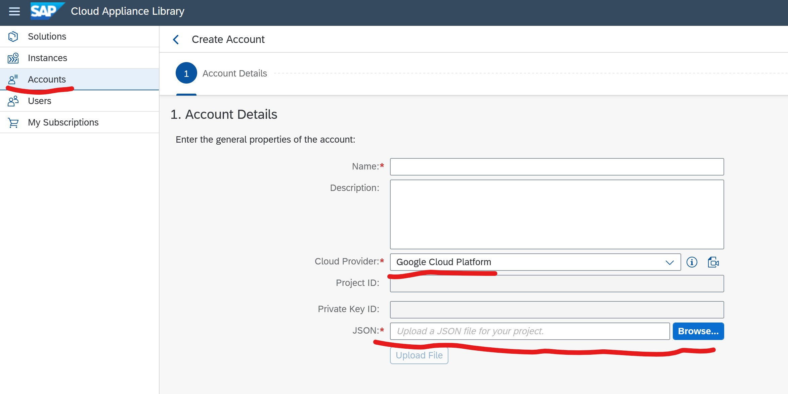

# SAP Cloud Appliance Library

Create a service account and private key JSON for SAP Cloud Appliance Library.

## Configuration

Configuration other than default values:

| Variable | Description | Value |
|----------|-------------|-------|
| MY_GCP_SA_NAME | Name of the new service account | `sa-sap-cal` |
| MY_GCP_SA_DISPLAY_NAME | Textual name to display for the account | SAP Cloud Appliance Library |
| MY_GCP_SA_DESCRIPTION | Textual description for the account | Service account for SAP Cloud Appliance Library |
| MY_GCP_SA_ROLES | Roles | `roles/compute.instanceAdmin.v1`, `roles/compute.networkAdmin`, `roles/compute.securityAdmin` |

## Scripts

* `01_create_sap_cal_service_account.sh` : Create a service account for the SAP Cloud Appliance Library
* `99_delete_sap_cal_service_account.sh` : Delete service account for the SAP Cloud Appliance Library
* `ZZ_debug.sh`                          : For debugging only

## Create Account

Upload `private_key_sa-sap-cal_JSON.json`:

