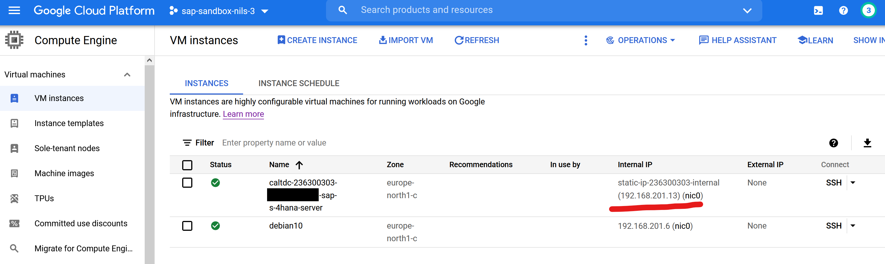

# SAP Cloud Appliance Library

Create a service account and private key JSON for [SAP Cloud Appliance Library](https://cal.sap.com/).

> SAP Cloud Appliance Library offers a quick and easy way to consume the latest SAP solutions in the cloud, such as SAP S/4HANA, SAP HANA Express Edition, Model Company Solutions, Industry Solutions etc.
> 
> It's an online library of latest, preconfigured, ready-to-use SAP solutions that can be instantly deployed into your own public cloud accounts (e.g. [...] Google Cloud Platform) to kick-start your SAP projects - within few hours!

## Configuration

Configuration other than default values:

| Variable | Description | Value |
|----------|-------------|-------|
| MY_GCP_SA_NAME | Name of the new service account | `sa-sap-cal` |
| MY_GCP_SA_DISPLAY_NAME | Textual name to display for the account | SAP Cloud Appliance Library |
| MY_GCP_SA_DESCRIPTION | Textual description for the account | Service account for SAP Cloud Appliance Library |
| MY_GCP_SA_ROLES | Roles | `roles/compute.instanceAdmin.v1`, `roles/compute.networkAdmin`, `roles/compute.securityAdmin` |


## Scripts

* `01_create_sap_cal_service_account.sh` : Create a service account for the SAP Cloud Appliance Library
* `02_details_for_sap_cal.sh`            : Show details and generate a valid SAP master password
* `99_delete_sap_cal_service_account.sh` : Delete service account for the SAP Cloud Appliance Library
* `ZZ_debug.sh`                          : For debugging only

## Create Account

Create a service account and key for SAP CAL:

```shell
bash 01_create_sap_cal_service_account.sh
```

Upload `private_key_sa-sap-cal_JSON.json`:


## Create Instance

Enable advanced mode:


Show details and generate a valid SAP master password:

```shell
bash 02_details_for_sap_cal.sh
```

Example:


Enter details:


Disable extra Windows virtual machine (we have our own Windows jump host. Please see [05_windows](../05_windows/)):


Keep clicking until all is completed 😀

## Connect

Get IP:



Get SAP system data:


Enter this information in your SAP logon and connect to the SAP system:


Have fun:

