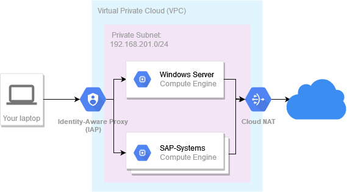

# SAP on Google Cloud Platform Boilerplate

[](#readme)
[](https://github.com/Cyclenerd/sap-on-gcp-scripts/blob/master/LICENSE)

---

## Public Archive Notice

This repository has been transitioned to a public archive.
While development has ceased, the codebase remains available for reference and historical purposes.

**Impact on Current Users:**

* New features and bug fixes will no longer be implemented.
* Issues and pull requests will not be reviewed or merged.

**Accessing the Codebase:**

* You can continue to clone, fork, and explore the code at your convenience.
* The codebase reflects the repository's state at the time of archiving.

**Staying Informed:**

* I recommend considering alternative projects that are actively maintained for your ongoing development needs.

**Contributing:**

* While new contributions are no longer accepted in this repository, feel free to explore forking the codebase and creating your own derivative project.

**Thank You:**

I appreciate your past contributions and interest in this project.
I hope the archived codebase remains a valuable resource!

---

A collection of Bash shell scripts with which you can quickly create your own Virtual Private Cloud (VPC) in the Google Cloud Platform.
In your VPC you can then start various servers.
Including Windows Server and SAP NetWeaver AS ABAP Developer Edition 7.52 SP04.

With this set of shell scripts you get the same setup on a small scale as with [large SAP on GCP projects](https://www.otto.de/jobs/technology/techblog/artikel/cloud-native-sap-operation-in-the-otto-group.php).

Your servers do not get public IP addresses and therefore are not accessible from the Internet.
This increases the security massively.
Your servers connect to the Internet via a Cloud NAT router.
The whole setup is comparable to your internet connection at home.
Here you are also hidden behind a NAT router.

Via the so-called Identity-Aware Proxy (IAP) you get access to your instances and can tunnel required ports to your laptop.

You can also start a [Windows server](05_windows/) with graphical desktop environment in your VPC and access your servers and SAP systems from there via Remote Desktop Protocol (RDP).



## Features

* ✅ Test SAP software without a paid SAP contract
* ✅ Quickly deploy and use latest SAP solutions in the Google Cloud Platform
* ✅ Stress-free and easy configuration of Google Cloud services
* ✅ Take advantage of Infrastrucure as Code (IaC)
* ✅ Own virtual private cloud (VPC)
* ✅ Windows jump host (RDP) with SAP GUI for Windows and Google Chrome
* ✅ Access to network and server via Identity-Aware Proxy (IAP)
* ✅ Already prebuilt scripts to stop all instances to save time and money
* ✅ Prebuilt scripts to create snapshots of the instances and later create a the VM back from the snapshot again

## Requirement

A Bash shell, Git and a few tools that are included in the standard GNU/Linux distribution.
In addition, you need the [Google Cloud SDK](https://cloud.google.com/sdk/docs/install) which is very easy to install.

If you don't have access to a local Bash shell or a Linux operating system, you can also use [Cloud Shell](https://cloud.google.com/shell/docs/using-cloud-shell).
Cloud Shell already has all requirements and in your Cloud Shell Terminal you can run the scripts.

You can also use [IAP Desktop](https://github.com/GoogleCloudPlatform/iap-desktop/) to connect to the Remote Desktop of your VM instances by using IAP TCP forwarding.

### Google Cloud

* Google Cloud account
* Valid Cloud Billing account (even if you are in your free trial period)

### Local

* GNU Bourne Again SHell
	* `bash` (Version >= 4)
* [Git](https://git-scm.com/)
	* `git`
* GNU coreutils
	* `sha256sum`
	* `grep`
	* `sed`
	* `patch`
	* `tr`
	* `tput`
* [Google Cloud SDK](https://cloud.google.com/sdk/docs/install)
	* `gcloud` (Version >= 357.0.0)
	* `gsutil` (Version >= 4.67)

## Tested

[](https://github.com/Cyclenerd/sap-on-gcp-scripts/actions/workflows/main.yml)

* Ubuntu on Windows (Windows Subsystem for Linux)

## Architecture

* Default region: `europe-north1` (Finland)
* Default zone: `europe-north1-c`
* Default name of the subnetwork: `subnet-europe-north1`
* The IP space allocated to the subnetwork: `192.168.201.0/24`

The following diagram shows the architecture for a default deployment of SAP NetWeaver AS ABAP Developer Edition 7.52 SP04:

```text
 +--------------------------------------------------------------------------+
 | Region: europe-north1                                                    |
 |                                                                          |
 | Cloud Storage (share-demo)                                               |
 |                                                                          |
 | +---------------------------------------------------------------------+  |
 | | Virtual Private Cloud Network (network-demo)                        |  |
 | |                                                                     |  |
 | | Cloud Router (router-europe-north1) with NAT (nat-europe-north1)    |  |
 | |                                                                     |  |
 | | +----------------------------------------------------------------+  |  |
 | | | Private Subnet (subnet-europe-north1): 192.168.201.0/24        |  |  |
 | | | +------------------------------------------------------------+ |  |  |
 | | | | Zone: europe-north1-c                                      | |  |  |
 | | | |                                                            | |  |  |
 | | | | » Compute Engine Instance (sapnw752sp4)                    | |  |  |
 | | | | › Persistent Disk (ssd-boot-sapnw752sp4)                   | |  |  |
 | | | +------------------------------------------------------------+ |  |  |
 | | +----------------------------------------------------------------+  |  |
 | +---------------------------------------------------------------------+  |
 +--------------------------------------------------------------------------+
```

## Setup

Clone this repo:

```
git clone https://github.com/Cyclenerd/sap-on-gcp-scripts.git
cd sap-on-gcp-scripts
```

You can do the whole setup with the Bash scripts.
Default values can be overwritten with a configuration file `config` in the folder.

I recommend you to change the value of the default variable `MY_GCP_SHORT_NAME`.
Use something unique like your name or a combination of numbers.

To do this, create a file named `config` in this folder:
```shell
# Short random name to quickly separate project, network and storage bucket name
echo "MY_GCP_SHORT_NAME=random-name-123" >> config
```

Further variables for configuration are explained below in the [Configuration](#Configuration) section.

The further setup until your first server looks like this:
```shell
# Project
cd 01_project/
bash 01_create_project.sh
bash 02_enable_services.sh
cd ../
# Network
cd 02_network/
bash 01_create_network.sh
cd ../
# Storage
cd 03_storage/
bash 01_create_storage_bucket.sh
cd ../
# First server
cd 04_debian/
bash 01_create_debian.sh
# SSH into server
bash 10_ssh_debian.sh
cd ../
# List
cd 01_project/
bash 10_list_project.sh
```

### Initial

1. [Create project and enable billing](01_project/)
1. [Enable APIs and services](01_project/)
1. [Create a Virtual Private Cloud (VPC)](02_network/)
1. [Create Google Cloud storage bucket](03_storage/)

### Server and Services

* [Debian Server](04_debian/)
* [Windows Server](05_windows/) with SAP GUI for Windows and Google Chrome
* [SUSE Linux Enterprise Server 15](10_sles/)
* [SUSE Linux Enterprise Server 15 for SAP](10_sles_for_sap/)
* [SAP NetWeaver AS ABAP Developer Edition 7.52 SP04](15_sap_nw_752_sp4/)
* [SAP Cloud Appliance Library](30_sap_cal/)

### Second Region and Network

* Region: `europe-west4` (Netherlands)
* Zone: `europe-west4-c`
* Name of the subnetwork: `subnet-europe-west4`
* The IP space allocated to the subnetwork: `192.168.204.0/24`

1. [Create a second Virtual Private Cloud (VPC)](25_2nd_region_and_network/)
1. [Debian Server](25_2nd_region_and_network/)

## Helper

* [Start & stop all VMs](99_start_stop/)
* [Delete project and all data](01_project/)
* [More commands](90_more_commands/)

## Configuration

You can overwrite the default configuration.
Just create a configuration file with the name `config` in this folder or in the subfolders.

Values from the configuration file in the subfolder overwrites values from the parent folder.

Example:
```shell
# Overwrite defaults
echo "MY_GCP_SHORT_NAME=nils" >> config
echo "MY_GCP_PROJECT=only-a-test" >> config
echo "MY_GCP_STORAGE=my-random-storage-name-123" >> config
# Change name of Compute Engine virtual machine instance
cd 04_debian
echo "MY_GCP_GCE_NAME=linux" >> config
```

### MY_GCP_SHORT_NAME

A short name to quickly separate project ID, network and storage bucket name.

* Variable: `MY_GCP_SHORT_NAME`
* Default: `demo`

By default, this name is used by the variables:

* [MY_GCP_PROJECT](#my_gcp_project) : Google Cloud project ID (`sandbox-$MY_GCP_SHORT_NAME`)
* [MY_GCP_NETWORK](#my_gcp_network) : Name of the Compute Engine network (`network-$MY_GCP_SHORT_NAME`)
* [MY_GCP_STORAGE](#my_gcp_storage) : Name of Google Cloud storage bucket (`share-$MY_GCP_SHORT_NAME`)

### MY_GCP_PROJECT

Google Cloud project ID

* Variable: `MY_GCP_PROJECT`
* Default: `sandbox-$MY_GCP_SHORT_NAME`
* Example: `sandbox-demo`

### MY_GCP_FOLDER

Optional ID for the folder to use as a parent for the project

* Variable: `MY_GCP_FOLDER`
* Default: none

### MY_GCP_REGION

Compute Engine region

* Variable: `MY_GCP_REGION`
* Default: `europe-north1`

### MY_GCP_ZONE

Fully-qualified name for zone

* Variable: `MY_GCP_ZONE`
* Default: `$MY_GCP_REGION-c`
* Example: `europe-north1-c`

### MY_GCP_ROUTER

Name of Compute Engine router

* Variable: `MY_GCP_ROUTER`
* Default: `router-$MY_GCP_REGION`
* Example: `router-europe-north1`

### MY_GCP_NAT

Add a NAT to Compute Engine router

* Variable: `MY_GCP_NAT`
* Default: `nat-$MY_GCP_REGION`
* Example: `nat-europe-north1`

### MY_GCP_NETWORK

Name of the Compute Engine network

* Variable: `MY_GCP_NETWORK`
* Default: `network-$MY_GCP_SHORT_NAME`
* Example: `network-demo`

### MY_GCP_SUBNET

Name of the subnetwork for the network

* Variable: `MY_GCP_SUBNET`
* Default: `subnet-$MY_GCP_REGION`
* Example: `subnet-europe-north1`

### MY_GCP_SUBNET_RANGE

IP space allocated to the subnetwork in CIDR format

* Variable: `MY_GCP_SUBNET_RANGE`
* Default: `192.168.201.0/24`

### MY_GCP_STORAGE

Name of Google Cloud storage bucket

* Variable: `MY_GCP_STORAGE`
* Default: `share-$MY_GCP_SHORT_NAME`
* Example: `share-demo`

### MY_GCP_GCE_NAME

Name of Compute Engine virtual machine instance

* Variable: `MY_GCP_GCE_NAME`
* Default: `default-name`

### MY_GCP_GCE_TYPE

GCE machine type

* Variable: `MY_GCP_GCE_TYPE`
* Default: `e2-micro`

### MY_GCP_GCE_IMAGE_FAMILY

Image family for the operating system that the boot disk will be initialized with

* Variable: `MY_GCP_GCE_IMAGE_FAMILY`
* Default: `debian-10`

### MY_GCP_GCE_IMAGE_PROJECT

Google Cloud project against which all image and image family references will be resolved

* Variable: `MY_GCP_GCE_IMAGE_PROJECT`
* Default: `debian-cloud`

### MY_GCP_GCE_DISK_BOOT_NAME

Name of the boot disk

* Variable: `MY_GCP_GCE_DISK_BOOT_NAME`
* Default: `ssd-boot-$MY_GCP_GCE_NAME`
* Example: `ssd-boot-default-name`

### MY_GCP_GCE_DISK_BOOT_TYPE

Type of the boot disk

* Variable: `MY_GCP_GCE_DISK_BOOT_TYPE`
* Default: `pd-ssd`

### MY_GCP_GCE_DISK_BOOT_SIZE

Size of the boot disk

* Variable: `MY_GCP_GCE_DISK_BOOT_SIZE`
* Default: `32GB`

### MY_GCP_GCE_SNAPSHOT_STORAGE_LOCATION

Google Cloud Storage location,
either regional or multi-regional,
where snapshot content of the disk is to be stored.

* Variable: `MY_GCP_GCE_SNAPSHOT_STORAGE_LOCATION`
* Default: `eu` (multible regions in European Union)
* Example: `europe-north1` (Regional in Finland)


### MY_GCP_GCE_STARTUP_SCRIPT_URL

Linux script that will be executed by the instances once they start running

* Variable: `MY_GCP_GCE_STARTUP_SCRIPT_URL`
* Default: `gs://$MY_GCP_STORAGE/startup/linux_startup_script.sh`
* Example: `gs://share-demo/startup/linux_startup_script.sh`

[View output](https://cloud.google.com/compute/docs/instances/startup-scripts/linux#viewing-output) of a Linux startup script:

```shell
sudo journalctl -u google-startup-scripts.service
```

### MY_GCP_GCE_WINDOWS_STARTUP_SCRIPT_URL

Windows PowerShell script that will be executed by the instances once they start running

* Variable: `MY_GCP_GCE_WINDOWS_STARTUP_SCRIPT_URL`
* Default: `gs://$MY_GCP_STORAGE/startup/windows_startup_script.ps1`
* Example: `gs://share-demo/startup/windows_startup_script.ps1`

### MY_GCP_GCE_SSH_COMMAND

SSH into Linux virtual machine instance and run this command

* Variable: `MY_GCP_GCE_SSH_COMMAND`
* Default: `uname -a`

### MY_GCP_SA_NAME

The internal name of the new service account

* Variable: `MY_GCP_SA_NAME`
* Default: `sa-gce-$MY_GCP_GCE_NAME`
* Example: `sa-gce-default-name`

### MY_GCP_SA_DISPLAY_NAME

Textual name to display for the account

* Variable: `MY_GCP_SA_DISPLAY_NAME`
* Default: `GCE $MY_GCP_GCE_NAME`
* Example: `GCE default-name`

### MY_GCP_SA_DESCRIPTION

Textual description for the account

* Variable: `MY_GCP_SA_DESCRIPTION`
* Default: `Service account for Google Compute Engine server $MY_GCP_GCE_NAME`
* Example: `Service account for Google Compute Engine server default-name`

### MY_GCP_SA_ROLES

IAM roles (policy binding) for service account

* Variable: `MY_GCP_SA_ROLES`
* Default:
	* `roles/logging.logWriter`
	* `roles/monitoring.metricWriter`
	* `roles/monitoring.viewer`

### MY_GCP_SECRET_NAME

Name of secret in Google Secret Manager

* Variable: `MY_GCP_SECRET_NAME`
* Default: `sec-$MY_GCP_GCE_NAME`
* Example: `sec-default-name`

## FAQ

* Q: Why shell scripts and not Ansible, Teraform, etc.?
* A: Ansible is another dependency you need to understand as well. Most people in the SAP area already know shell scripts. Therefore shell scripts.

## Contributing

Have a patch that will benefit this project?
Awesome! Follow these steps to have it accepted.

1. Please read [how to contribute](CONTRIBUTING.md).
1. Fork this Git repository and make your changes.
1. Create a Pull Request.
1. Incorporate review feedback to your changes.
1. Accepted!

## License

All files in this repository are under the [Apache License, Version 2.0](LICENSE) unless noted otherwise.
